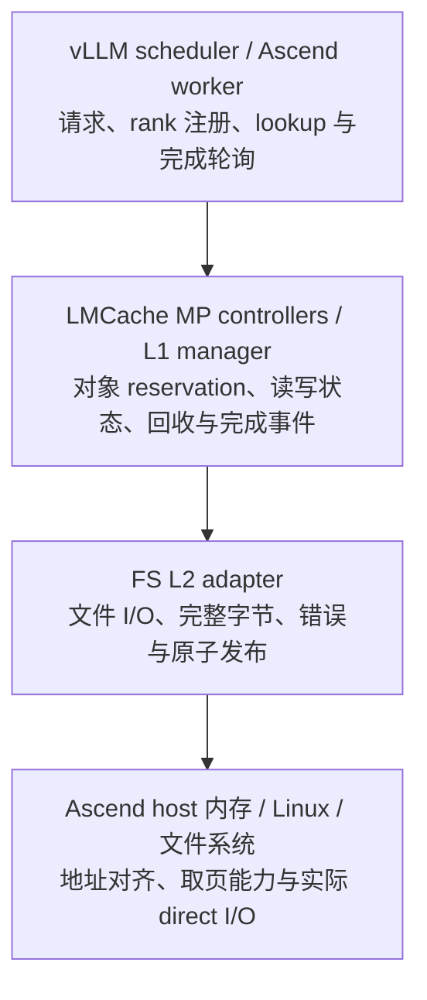

# LMCache-Ascend SSD 修复方案与最小实验计划

日期：2026-10-10。本文是可用于开发与评审的修复设计，**没有把候选方案伪装成已实现、已通过真机验证的补丁**。

原文整理：[01_原文整理.md](01_原文整理.md)。依据与审查发现：[02_技术审查与公开问题.md](02_技术审查与公开问题.md)。

## 1. 推荐决策

当前先不合入“`bytes()` + 局部 `pin/unpin` = 两个 UAF 已修复”的版本。

按以下顺序完成：

1. **锁定现有实验环境**：取得容器 fork commit、实际加载文件、完整两处 diff 和本轮请求日志。不升级整个 LMCache 或 vLLM。
2. **做一个能区分根因的缓冲区实验**：在相同 SSD 路径上比较持续保活的原 host 内存与普通对齐 host 内存。
3. **按证据选最小修改**：仅生命周期有问题就修 reservation；原 host 映射不能 direct I/O 则使用普通对齐中转缓冲区；单纯对齐问题可在 Ascend 的实际分配路径修正基地址，或局部采用对齐中转。
4. **补齐当前 FS 写入正确性缺口**：检查完整写、避免发布坏文件；读取成功必须以完整字节和正确 copy-back 为准。
5. **把冷启动作为独立缺陷修复**：检查已知 heartbeat guard，并追踪首请求注册、lookup、prefetch、retrieve 的等待点。
6. **通过 L2-only 与无热身首请求验收后交付**：代码与构建入口优先放 LMCache-Ascend；性能调优排在正确性之后。

临时需要恢复可用性时，可先用现有 `use_odirect=false` 配置做 buffered 回环验证。通过后作为临时运行方式，明确记录其实际模式；不能把该结果计作 O_DIRECT 修复通过，也不能假定关闭 O_DIRECT 会自动消除生命周期错误。

## 2. 先明确三层责任



- **A 层卡住**：不能靠改文件 I/O 保活解决。
- **B 层提前释放**：不能靠 L2 里临时加 pin 保证所有路径安全。
- **C/D 层不接受 ACL 内存**：即使对象永不释放，direct I/O 仍可能失败；需要对齐或 staging。

这三条可以同时存在，但必须分别提供证据。外部 L2 插件能修自己的 I/O；若 B 层实际违反生命周期契约，仅换插件无法保证正确，需要对调用方做局部兼容修补。

## 3. 尽量只修改 LMCache-Ascend 的交付路线

### 3.1 默认路线：使用已有外部 L2 插件入口

公开 `v0.5.5rc7` 已支持 `type=plugin`，用 `module_path`、`class_name` 加载外部 adapter。可以把 Ascend FS 适配代码放在我们自己的包内，通过配置启用，无需新建插件框架，也无需修改用户安装的上游源码。[插件加载源码](https://github.com/LMCache/LMCache/blob/v0.5.5rc7/lmcache/v1/distributed/l2_adapters/plugin_l2_adapter.py)。

**前置条件**：现场 fork 保留该入口，并且 LMCache server 进程能正常导入对应的 `lmcache_ascend` 包；不能只验证 vLLM worker 导入成功。

建议文件范围，名称为拟议名称：

```text
LMCache-Ascend/
  lmcache_ascend/v1/distributed/ascend_fs_l2_adapter.py
  tests/v1/distributed/test_ascend_fs_l2_adapter.py
  <现有 MP 启动示例或配置文件>
```

实现优先复用现有 FS adapter 的 key 命名、lookup、结果与事件接口，仅定制具体读写行为。如果复用必须大面积覆盖私有控制流，则改用下一条小补丁路线，不复制一整份上游 adapter 来维持两个版本。

配置形态示例；类和模块在实现前不可直接运行：

```json
{
  "type": "plugin",
  "module_path": "lmcache_ascend.v1.distributed.ascend_fs_l2_adapter",
  "class_name": "AscendFSL2Adapter",
  "adapter_params": {
    "base_path": "/mnt/gmem/l2cache",
    "relative_tmp_dir": ".tmp",
    "use_odirect": true
  }
}
```

此路线不保证“所有问题只需一个文件”：若根因在 controller 提前回收或 scheduler heartbeat，仍需针对相应职责修复。原则是将变更管理集中在 Ascend 仓库，避免维护无关的大 fork。

### 3.2 最快兼容路线：Ascend 仓库携带小补丁并在构建时应用

现场 fork 没有可用插件入口，或改 helper 比独立 adapter 更小、更清晰时，采用：

```text
docker/lmcache-fs-direct-io.diff
<实际用于该 MP 镜像的 Dockerfile / 构建脚本>
<该镜像现有部署说明>
```

这是“我们只提交到 Ascend 仓库”，运行时仍会修改 LMCache 依赖的行为。需要在评审里明确这一区别。

必须完成的交付步骤：

1. 补丁基于现场支持的准确 commit，使用真实 diff，不凭照片中的省略代码拼装可执行补丁。
2. 在安装依赖的同一源码树上先检查补丁是否适用，再应用；检查失败时构建失败，不使用 `|| true` 忽略。
3. 补丁应用后才构建 / 安装对应代码，或在确认的 editable 安装路径上应用。
4. 镜像内核对实际 `lmcache.__file__`、adapter 类来源及修复函数来源，防止改了源码但运行了另一个 wheel。
5. 再次构建同一镜像也必须包含修复。仅手改容器或新增未被消费的 `.diff` 文件不算交付。
6. 与读取缓存相关的进程使用同一套 key / layout / dtype 约定；不把 ABI 不兼容文件解释为新补丁失败。

现有 Ascend 仓库确有 `lmcache-controller.diff` 的使用先例，但本轮没有发现该先例可以证明新 diff 会被自动应用。必须修改实际 MP 构建入口。不要顺手把公开 main 的 0.4.x Dockerfile 整体升级成 0.5.5；应基于你们已经工作的 MP 分支落补丁。

### 3.3 为什么不首选其他路线

| 路线 | 判断 |
|---|---|
| 全局修改 `MemoryObj.byte_array`，一律复制 | 不采用。其他调用者可能需要原地写入、共享内存和零拷贝语义，影响面太大 |
| 所有 I/O 外围都加 pin | 不采用。可能重复上层管理，不能解决所有直接 free，且取消边界仍需设计 |
| 默认切到另一种 SSD backend | 不作为第一修复。更换 backend 会引入布局、依赖、兼容性新变量 |
| 先统一全仓 9 类 O_DIRECT 实现 | 超出当前任务。只修现场 FS MP 路径 |
| 修改 CANN / Linux 内核映射标志 | 无现场根因证据，不采用；中转缓冲区通常是更局部的兼容方案 |
| 仅等上游合并 | 不必。可在 Ascend 中先交付最小已验证修复，再把通用部分反馈上游 |

## 4. 候选补丁的正确行为

### 4.1 如果实验确认需要 staging

采用**普通、地址对齐、可被 Linux direct I/O 接受的 host 中转区**。它与 ACL/NPU 传输所需的 pinned host 内存是不同角色。

```text
写：L1/ACL 源对象 --CPU copy--> 对齐普通 host staging --O_DIRECT--> 临时文件
                                                           完整成功后 rename

读：SSD 文件 --O_DIRECT--> 对齐普通 host staging --CPU copy--> L1 目标对象
                                                       copy-back 完成后报告命中
```

此方案仍可绕过内核 page cache，但增加 CPU memcpy；因此不要称作“全路径零拷贝”。CPU 能否安全访问源/目标由现有 host buffer 契约与实测确认，不能将 NPU device pointer 直接拿来 memcpy。

具体约束：

- 对齐值优先取目标文件系统可查询的 DIO 要求；旧内核无法查询时使用目标部署已实测的值，并记录假设。
- 同时验证**实际地址**、传输长度和 offset。对齐池内偏移不代表基地址对齐。
- 可用匿名 mmap 加适当偏移、或已有的对齐分配 helper；无需引入新依赖。
- 先保留中转区 owner，再取得字节视图；worker 结束前不得释放 owner。操作 `memoryview` 时统一到连续的字节视图，避免把元素数误当字节数。
- 第一版保留现有磁盘格式。本案例的 9 MiB 已能满足常见对齐长度；其他长度不能未经格式设计直接追加 padding，导致旧 reader 不兼容。
- 当前 I/O 若不满足 direct 要求，必须明确记录为失败或明确的 buffered 操作；不得把它算进 direct 验收。初版无需再设计通用策略框架。
- 读入 staging 后必须拷回原目标，并等拷贝完成才置成功 bitmap。原文“读侧不能简单 bytes 拷贝”的提醒是对的，但**staging + copy-back 是可行的不同方案**。

下面是行为顺序，不是可直接替换源码的实现：

```python
# store: caller's reservation is already held
staging_owner, staging_view = allocate_verified_aligned_host_buffer(nbytes)
copy_bytes(staging_view, source_byte_view)
write_exact_to_unique_tmp(staging_view)  # validate every return count
publish_final_file_only_after_success()

# load: caller's write reservation is already held
staging_owner, staging_view = allocate_verified_aligned_host_buffer(nbytes)
read_exact_from_file(staging_view)
copy_bytes(destination_byte_view, staging_view)
publish_load_success()  # after copy-back, not merely after disk read
```

可先每个 in-flight I/O 分配一个中转区，避免立即引入缓冲池。若性能数据证明分配成本明显，再在现有 worker 中复用固定缓冲；同时限制实际并发量，不能无界提交大块复制。以 `K` 个 9 MiB I/O 同时在途计，额外 staging 大约为 `K × 9 MiB`，还未包括源 L1、请求队列与其他进程内存。

### 4.2 生命周期：优先修正已有 reservation

期望时序：

```text
reserve source / destination
    -> 提交到异步队列
    -> worker 实际执行
    -> 写完整 / 读完整并 copy-back
    -> 发布完成结果
    -> caller 释放 reservation
```

要核对的不变量：

1. 每个 task 只获得和释放一次对应 reservation，包含错误分支。
2. 队列等待期间对象仍有效。
3. source copy-in 时不能被另一任务修改或回收。
4. load copy-back 结束前目标不能被释放或复用。
5. coroutine 取消、请求超时、session 清理不能把“客户端不等了”当成“worker 不会再访问对象”。
6. adapter close 先停止接收新任务，收尾在途 I/O，再释放事件 fd 和内存资源。
7. 若现场存在 TTL 强制释放，需证明 TTL 不会让仍在访问的对象进入 free / reuse；提高 timeout 只能改变触发概率。

不要简单把 `unpin()` 移到另一个 finally 就宣布解决。正确实现可以等待实际 worker 完成再交还所有权，或由任务完成回调归还资源，但需与上层完成通知保持一致。只加 `asyncio.shield()` 也不自动让外层 finally 延后。

### 4.3 文件正确性：正式文件代表完整对象

写路径最小要求：

- 循环处理合法短写；每次检查正进度，且剩余 buffer / offset 仍符合对齐限制。无法安全继续就报告失败。
- 临时文件不继承旧尾部，长度必须符合本对象格式。
- 同 key 并发写使用独立临时文件或现有同 key 去重机制，不能两个 worker 一起操作同一 tmp。
- 仅全量成功后原子 rename；失败清理本次临时文件并返回失败。
- “已有文件”至少不能让已知截断文件永久阻止恢复。对当前请求发现的坏 key，记录并隔离或移除其无效缓存文件，再允许重建；不扫描或清空整个缓存库。

读路径最小要求：

- 缺失、短读、异常、copy-back 失败均不得置成功 bit。
- 一批部分失败要保留逐 key 结果，不能把整批声明为成功。
- 如果对象布局要求精确长度，则检测不匹配文件，避免误把旧布局文件当成命中。
- I/O 失败可退回正常 prefill，但必须能从 L2 结果看出失败，而不是只看 HTTP 成功。

“成功写入”在这里是文件系统可见并能读回。O_DIRECT 不自动等于掉电持久化；原任务是可重建 KV 缓存，本轮不增加强制 fsync / 目录持久化要求，除非你们另有断电持久性承诺。

### 4.4 冷启动：检查已知缺陷，定位未知等待

第一步检查现场 scheduler 是否存在：

```python
self._heartbeats = {}
# ...
if self._heartbeats is not None:
    return
```

若两处 double-check guard 都是此形态，应与 [上游 PR #4764](https://github.com/LMCache/LMCache/pull/4764) 对照做小范围回移；保留现有锁。它只修“未启动 heartbeat”，不替代服务重启后的上下文恢复。

围绕同一 request ID 记录如下事件即可，不需要新增完整 tracing 平台：

```text
server PID/启动代次
rank 注册开始与完成
layout/context registry 可用
lookup 提交与 ACK
prefetch request ID 创建
L2 load 提交与完成
QUERY_PREFETCH_STATUS 的 pending/终态
prepare retrieve / worker copy / commit retrieve
session end / cleanup
```

目标行为：

- 服务 readiness 在所需 rank / context 准备好后才允许依赖该状态的读取，或用已有接口返回明确的暂不可用结果。
- missing context、lookup 失败、server 死亡应使请求在既定时限内进入明确终态或退回 prefill，不能永久 pending。
- 对尚未完成 KV load 的请求，不得标为已命中而继续使用部分 KV。缓存 miss 退回计算必须经过推理引擎现有的正确回退路径。
- server 重启时不得沿用旧的已注册判断；根据现有协议重新注册，或明确拒绝失效会话并恢复服务。
- 不以“先发一个真实短请求”作为最终初始化协议。

若根因只存在于 LMCache 的集成 adapter，可由 Ascend 构建补丁修复该依赖，不优先修改 vLLM / vllm-ascend 主体。若证据最终指向 vLLM 的调度协议缺陷，应承认边界，而不是在存储插件里掩盖。

## 5. 需要补的实验：先做这六组

所有新实验放在同一 SSD 的专用新目录，保留现有 28 个文件与旧日志。使用明确 PID / 实验容器管理重启，不复用广泛 `pkill -f` 或删除原缓存目录的命令。

### E0：版本与输入固定

只收集对本问题有判别力的信息：

- LMCache、Ascend、vLLM、vllm-ascend 的 commit / 安装版本与实际 import 路径。
- Python、torch_npu、CANN / driver、Linux kernel；挂载类型与实验目录所在设备。
- allocator 类型、L1 是否 lazy / SHM、实际 base pointer、object pointer、长度、offset、DIO 要求。
- 模型 revision、KV dtype、TP=4、chunk=256、APC 开关和 tokenizer 后的实际 token 数。
- prompt 保存为固定输入；预填充与读取使用完全一致的 token 前缀。通过 JSON 库生成请求，避免引号转义改变输入。

**完成条件**：写与读面对同一套 key / rank / 布局，且能说明实际加载的是哪份代码。不需要文件 hash 或全目录扫描。

### E1：最小缓冲区对照——决定修哪一层

不用大模型，使用相同 Linux 文件系统与 9 MiB 数据，填入已知可比对模式。整个实验期间明确持有对象，不执行 free / eviction。

| 行 | 源 / 目标内存 | 方式 | 用途 |
|---|---|---|---|
| A | 普通、已验证对齐的匿名 host 内存 | O_DIRECT 写 + 读 | 验证文件系统和基础 I/O 可用 |
| B | 当前真实 L1 / ACL host 内存 | O_DIRECT 写 + 读 | 判断在无生命周期争议时是否仍失败 |
| C | 当前真实 L1 / ACL host 内存 | buffered 写 + 读 | 分离 direct I/O 特有限制 |
| D | 当前 L1 ↔ 对齐普通中转区 | O_DIRECT 回环 + copy-back | 验证 staging 兼容方案及数据正确性 |

每行检查 errno、请求 / 返回字节数、实际指针余数，以及**原始数据与读回数据逐字节一致**。不需要计算 checksum。

解释：

- A 成功、B 在强保活下仍 EFAULT、D 成功：优先研究映射兼容性；UAF 不能作为唯一解释。
- B 指针未对齐且报 EINVAL：优先修真实基地址/对象地址；不要仅增加 `align_bytes` 配置值。
- B 单线程稳定通过，只有异步压力下失败：进入 E2 查生命周期；还不能马上确定 UAF。
- A 自身失败：先查目标文件系统与对齐要求，不继续从 LMCache 生命周期推导。

检查 `/proc/<pid>/smaps` 时只读取缓冲区对应的 VMA 段与 `VmFlags`；`io` / `pf` 是线索，结合现场内核与驱动分析，不直接断言所有 ACL 分配均相同。

### E2：生命周期与取消——决定是否改 pin 补丁

通过现有 adapter 公共提交接口执行一个 store 和一个 load，用可控延迟使 worker 暂停在 I/O 期间。

覆盖当前有风险的四个时点：

1. task 已提交、尚未开始；
2. worker 正在读写；
3. 请求超时 / 协程取消；
4. adapter 正在 close。

同时在受控小 L1 中施加对象回收压力，记录 reservation、free / invalidate、地址复用与 worker 完成。**完成条件**：worker 仍可能访问内存时，区间没有被回收或重用；成功与失败后资源最终释放一次，没有 pin 泄漏。若 controller 已正确保护，删除无作用的重复 pin；若发现违规，在真实释放链上修。

### E3：文件错误路径——阻止“成功但数据坏”

以每个 key 不同的数据模式测试以下小集合：

- 注入短写、零进度写、短读；
- 一个缺失文件、一个截断文件；
- 两个同时存同一 key 的任务；
- 一批 key 中只有一个失败。

**完成条件**：只有完整数据可成为最终文件与成功 bitmap；失败 key 不会长期因为 `exists()` 被永久跳过；其他成功 key 不被误判；临时文件没有相互覆盖。测试不涉及原有真实缓存目录。

### E4：真正 L2-only 的端到端读取

顺序必须固定：

1. 新实验目录，原 APC 关闭，发送固定长前缀，记录实际 7 个 chunk / 4 rank 是否确实形成预期 key 集合。
2. 等对应 L2 store 完成，而不是固定 sleep 后仅数文件；记录最终文件大小。
3. 停止并重启所有持有 L1 的实验服务，保留 L2；记录新 PID 与 L1 初始无该 key。
4. 第一条业务请求直接发送相同长前缀，不热身。
5. 关联 L2 load、文件字节读取、rank 对象完整加载、NPU retrieve 和 prefill token 减少。
6. 在另一个新实例 / 新目录做 L2 缺失的负向对照，确认它确实退回 prefill。

**完成条件**：来源可追踪到 L2，所有必要 rank 的正确 KV 被消费，结果与无缓存基线一致。可固定解码参数比较生成 token；若设备存在数值非确定性，额外比较选定 logits / KV 张量并明确容差，不能只凭“看起来像正确回答”。

小模型输出正常不等于缓存内容正确；E1/E3 的逐字节比较与这里的端到端输出一起构成证据。

### E5：无热身冷启动与故障恢复

只做对当前症状有区分力的场景：

| 场景 | 预期 |
|---|---|
| server + vLLM 同时重启，首请求 L2 hit | 首请求有界完成，无需第二个请求解锁 |
| 同时重启，首请求 L2 miss | 正常 prefill，没有永远 pending |
| server 单独重启、worker 保留 | 明确恢复注册或明确回退，不沿用失效状态 |
| 查询中 server 退出 | 请求在已有服务时限内进入失败/回退终态，后续可恢复 |

首次定位建议每个有关联的冷启动场景做 3 次；若出现偶发失败，再对失败场景扩大次数，而不是无差别跑大矩阵。目标是观察具体触发链，不是用三次成功声称统计可靠性。

**完成条件**：没有首请求挂住；没有为缓存失败而永久卡住推理；heartbeat 存在且能识别状态变化；失败后的下一次正常请求可用。

## 6. 正确性完成后再做性能判断

不要求先跑全量压测。先在相同长前缀、相同并发下比较：

| 对照 | 用途 |
|---|---|
| 无 LMCache / 明确 miss | 计算重算基线 |
| buffered L2 | 当前最简单可用路径 |
| 修复后的 O_DIRECT L2 | 判断 bypass page cache 的净收益与 CPU copy 成本 |

记录真实 streaming TTFT、端到端延迟、prefill token 数、L2 load 字节/时间、L1→NPU 传输时间、CPU 与 host 内存峰值。`Retrieved ... in 43 ms` 不能直接当 SSD 读取时间。

需要捕获直通路径时，可在短诊断窗口追踪目标进程与测试目录对应的 `openat/read/readv/write/pread64/pwrite64/rename`；用 fd 路径与返回字节数关联。系统调用中带 O_DIRECT 是必要线索，但某些文件系统可能内部 fallback，需结合该挂载的已知行为或内核跟踪确认。性能计时使用关闭详细追踪的单独一轮，避免追踪开销污染结论。

若数据表明队列串行占主导，再分别调整 affinity worker 与 FS 批内并发；不要一次改变两个维度。上游 [#4365](https://github.com/LMCache/LMCache/issues/4365) / [#4366](https://github.com/LMCache/LMCache/pull/4366) 可提供方向，不能直接承诺本环境有 2.2× 收益。

## 7. 建议拆成的小补丁

| 补丁 | 必要条件 | 建议范围 | 验收 |
|---|---|---|---|
| A：FS I/O 正确性 | 现有 helper 的完整写缺口已确认；staging 由 E1 决定 | Ascend FS adapter 或构建内的小型 upstream diff | E1、E3、E4 |
| B：生命周期 | E2 发现 controller / fork 提前释放时才做 | 真实提交、完成、清理的少量函数；不全局重写 MemoryObj | E2 与 E4 |
| C：冷启动 / heartbeat | fork 保留已知 guard 或 E5 定位到相应等待链 | Ascend 集成层，或 Ascend 构建管理的 LMCache integration 小补丁 | E5 |
| D：交付连接 | 必做 | 插件启用配置或实际镜像构建入口 | 新构建镜像实际加载 A/B/C 并走成功路径 |

不要求四个都一定有代码改动：B 没有证据就不加；C 应按真实缺陷决定。性能并发另立后续变更，不与正确性修复混在一起。

候选标题在根因未确认前可用：

```text
fix(mp-fs): make Ascend direct I/O buffer handling and completion reliable
```

待证据确认后再改成具体根因标题。PR 描述至少区分：现场重现、代码分析、本机机制实验、Ascend 真机验证，不能把它们合并成一个“all tests passed”。

## 8. 最终验收与回退

| 维度 | 必须满足 |
|---|---|
| 写 | 完整正确数据、最终文件大小正确、无短写假成功 |
| 读 | 已证明 L1 miss → L2 load → copy-back → NPU 实际使用，所有所需 rank 齐备 |
| 生命周期 | 在途区间不被回收 / 复用；错误、取消、关闭路径无泄漏与提前释放 |
| 冷启动 | 不热身的首个 L2 hit 能完成 |
| 故障 | 缓存层错误可观测并有界结束，不永久阻塞推理 |
| 直通模式 | 有目标环境的实际 direct I/O 证据，未把 buffered fallback 混计 |
| 交付 | 从 Ascend 仓库重新构建后修复仍存在，实际加载路径正确 |

回退应使用既有配置切回经过验证的 buffered adapter 或回到旧镜像；保留测试日志与数据目录。若补丁保留磁盘格式，同一缓存可在兼容 reader 下复用；若最终确实改变格式，则使用独立目录，不能让新旧格式混写。

原报告 C4 建议先使用如下结论：

> 指定 Ascend MP 环境的 FS O_DIRECT 读写曾出现 EFAULT。临时修改后观察到文件与取回记录，但根因及 L2-only 读取证据仍需补齐。当前不将 plain bytes + 局部 pin 视为正式修复。以实际缓冲区对齐 / 映射实验确定 I/O 方案，并完成无热身冷启动与端到端 KV 正确性验证后，再将状态更新为“指定版本与配置下已验证可用”。

## 9. 本轮完成与下一步交接

已完成：照片整理、公开源码核对、相似 issue / PR 调研、两处补丁审查、验证缺口分析、Ascend 优先的修复设计，以及三个本机机制探针。

未执行：原 fork 的实际修改、镜像构建、Linux / SSD / NPU 真机回归、上游提交。用户此次要求的是分析与方案，因此没有把尚未确认的方案应用到现有项目。

开始实现时最有价值的补充材料只有三项：**原 fork 的准确 commit 与实际修改 diff、一次完整失败到成功的请求日志、E1 的原 host 内存与对齐普通内存对照结果**。它们将决定最终是修生命周期、修对齐、加 staging，还是组合其中的必要部分。
